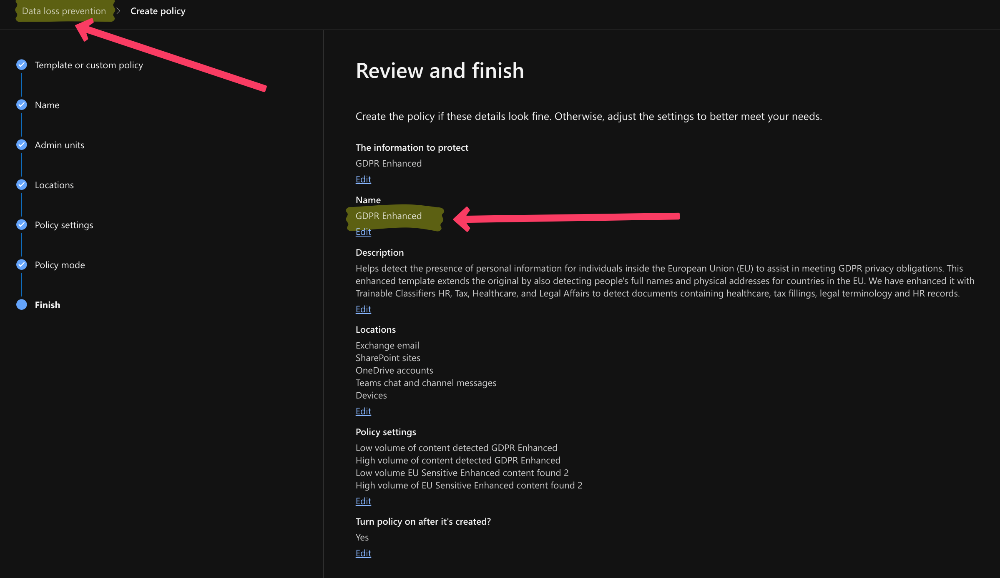
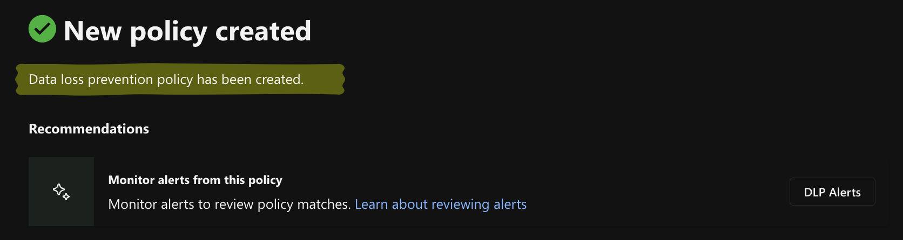
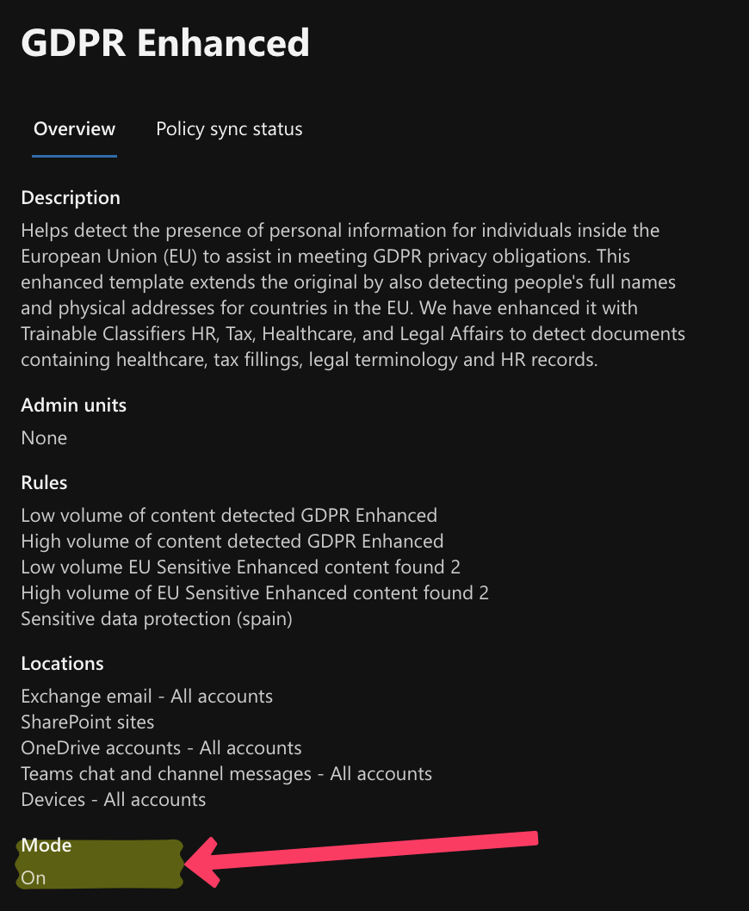
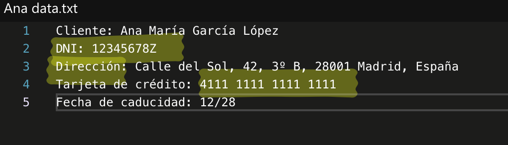
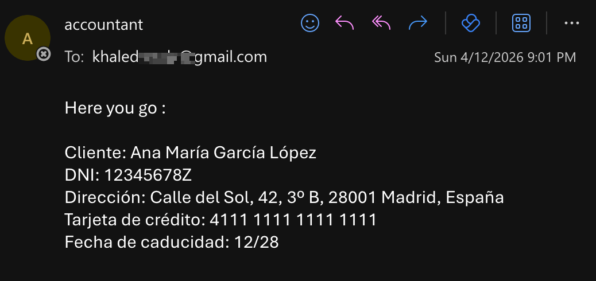
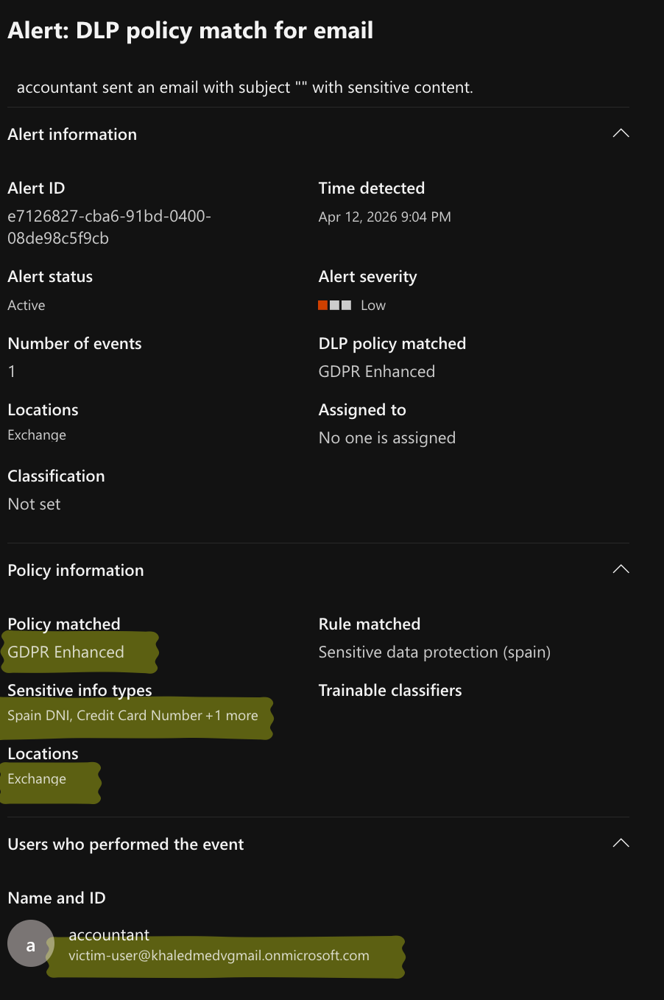
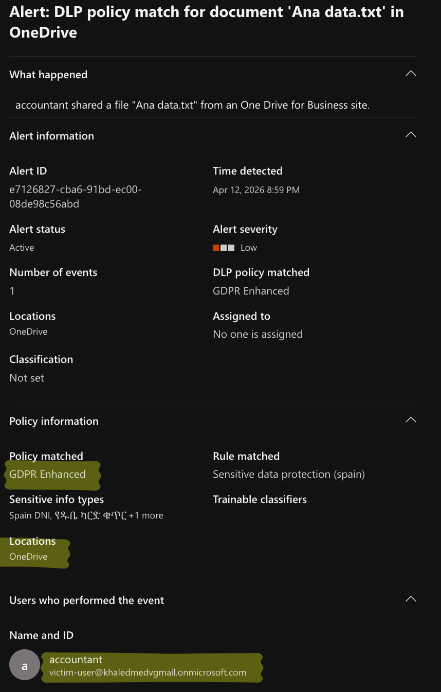
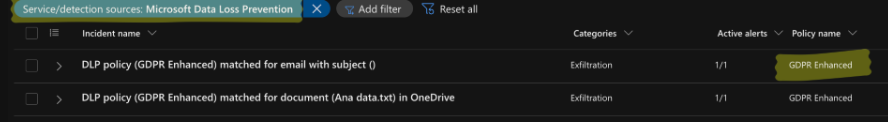
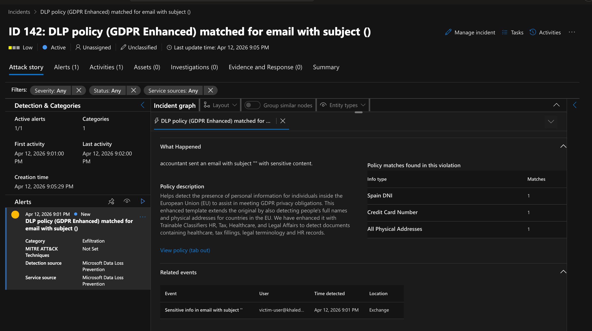
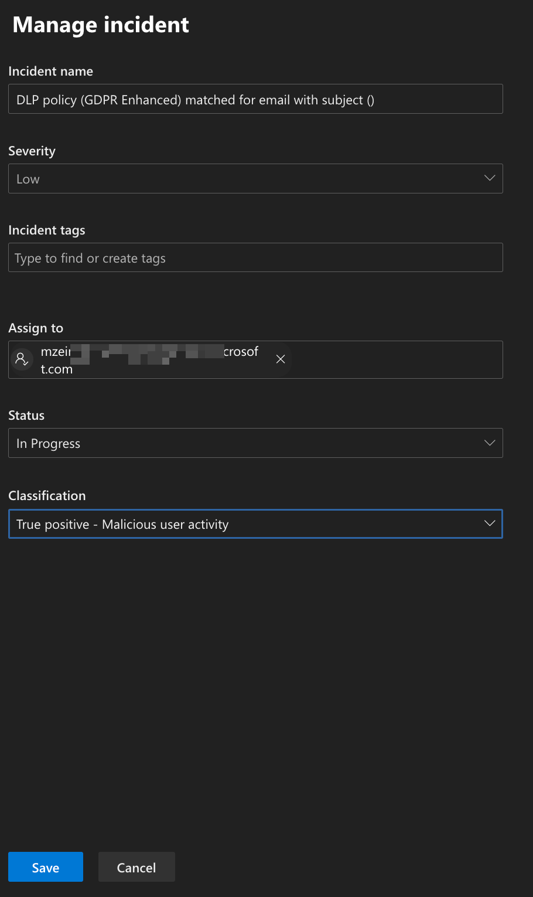

# Enterprise-DLP-Exfiltration-Response
Simulating an insider threat data exfiltration event using Microsoft Purview DLP, Defender XDR, and GDPR compliance frameworks.

## Objective
The objective of this project was to engineer, simulate, and triage a Data Loss Prevention (DLP) environment using Microsoft Purview and Microsoft Defender XDR. The simulation focused on protecting highly sensitive Personal Identifiable Information (PII) under GDPR mandates, specifically targeting Spanish National Identity (DNI) and financial data. 

This project demonstrates the complete data protection lifecycle: Policy Engineering, Threat Simulation, Alert Triage, and Incident Response.

## Tools & Technologies
- **Platform:** Microsoft Purview Information Protection, Microsoft Defender XDR
- **Security Engineering:** DLP Policy Creation, Trainable Classifiers, Sensitive Information Types (SITs)
- **Data Environments:** Exchange Online, OneDrive for Business
- **Incident Response:** Data exfiltration triage, Insider Threat mitigation, GDPR compliance protocols

---

## Phase 1: Policy Engineering (GDPR Enhanced)
To meet strict European privacy obligations, I engineered a custom DLP policy extending the built-in Microsoft GDPR template to monitor Exchange, SharePoint, OneDrive, and Endpoint devices.

*Description: The final configuration review of the "GDPR Enhanced" policy, confirming the target locations and specific conditions prior to deployment.*

*Description: System confirmation that the Data Loss Prevention policy was successfully provisioned to the tenant.*

*Description: Verification that the policy was placed in active enforcement ("Mode: On") rather than testing mode, ensuring immediate blocking and alerting upon matching.*

---

## Phase 2: Data Creation & Exfiltration Simulation
To validate the detection capabilities of the policy, I generated a synthetic document containing protected PII and attempted to exfiltrate it outside the corporate boundary.

### 1. Payload Creation
I created a plain text file (`Ana data.txt`) containing realistic but synthetic data to trigger the targeted Sensitive Information Types (SITs).

*Description: The synthetic payload containing a Spanish DNI number (`12345678Z`), a physical address in Madrid, and a standard 16-digit credit card number.*

### 2. Exfiltration Vectors
To simulate an insider threat or compromised account, the file was exfiltrated via two distinct corporate channels: uploaded to OneDrive, and emailed directly to an external Gmail account.

*Description: Outlook web interface showing the simulated insider threat sending the sensitive payload to an unauthorized external Gmail address.*

---

## Phase 3: Purview Alert Generation
Microsoft Purview successfully intercepted the exfiltration attempts across both vectors, generating immediate compliance alerts based on the SIT matches.

*Description: The Microsoft Purview compliance dashboard displaying two distinct, high-severity alerts for the single file (one for Email, one for OneDrive).*

*Description: Detailed telemetry of the Email alert, explicitly highlighting the exact SITs matched (Spain DNI, Credit Card Number) and the offending user.*

*Description: Detailed telemetry of the OneDrive alert, capturing the unauthorized file sharing from the corporate OneDrive for Business site.*

---

## Phase 4: Defender XDR Incident Triage
Modern SOCs do not work in isolated portals. The Microsoft Purview alerts successfully flowed into the unified Microsoft Defender XDR incident queue for SOC correlation and triage.

### 1. Incident Correlation
Defender XDR automatically correlated the separate DLP alerts into a single actionable incident.

*Description: Defender XDR incident queue showing Incident ID 142, correlating the exfiltration attempts into a single attack story.*

*Description: Defender XDR Incident ID 142 expanded, showing the attack story and incident detaills focused on the email exfiltration alert.*

### 2. Incident Management & Classification
After verifying the payload and the unauthorized external destination, I took ownership of the incident and formally classified the alert.

*Description: Assuming ownership of the incident and classifying it as a "True Positive - Malicious user activity" to finalize the investigation phase.*

---

## Phase 5: Incident Response Playbook
Because this simulation successfully generated a True Positive for data exfiltration, standard operating procedures dictate immediate containment. 

**If this were a live corporate incident, I would execute the following response plan:**

1. **Verify Intent vs. Compromise:** Analyze Entra ID sign-in logs to determine if the user's account was compromised (e.g., impossible travel, anomalous IP) or if this was an intentional action by the employee (Insider Threat).
2. **Data Containment (Exchange):** Utilize Microsoft Purview eDiscovery or Exchange PowerShell to perform a message trace and hard-delete the email from any internal recipient inboxes.
3. **Data Containment (OneDrive):** Immediately revoke the external sharing link for `Ana data.txt` via the SharePoint admin center to cut off external access to the payload.
4. **Identity Containment:** If account compromise is suspected, immediately revoke all active Entra ID sessions for the user and force a cryptographic password reset.
5. **Escalation & Compliance:** Escalate the incident to the Data Privacy Officer (DPO), Human Resources, and Legal department. Under GDPR Article 33, the organization may have 72 hours to report the breach to the supervisory authority.
